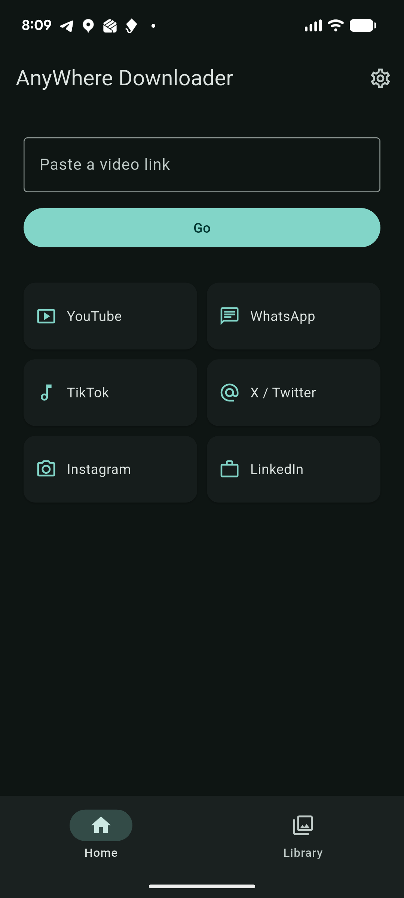
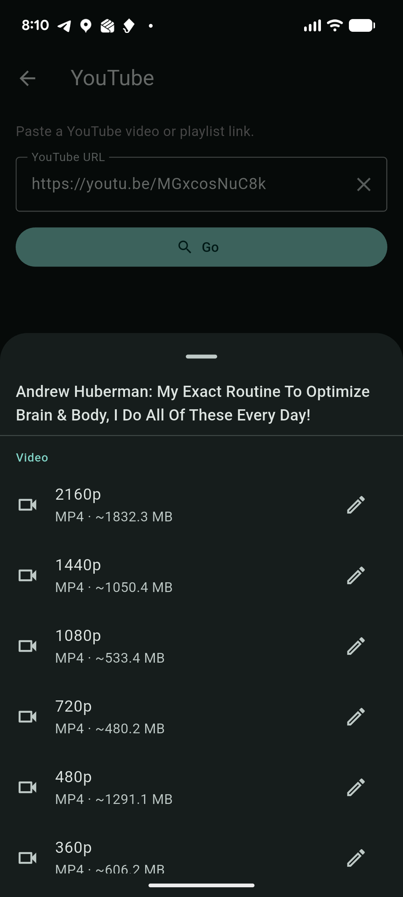
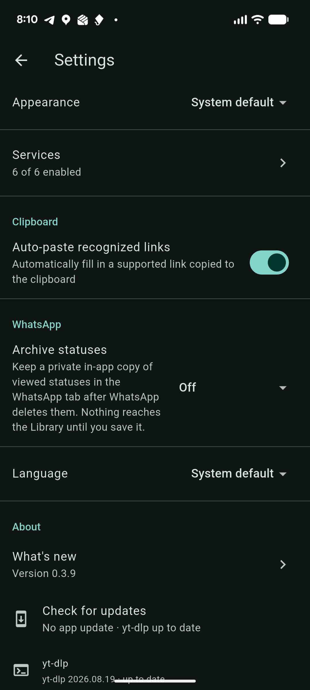

# AnyWhere Downloader

An Android app for saving videos, photos and audio to your device from a link you
paste (or one it picks up from the clipboard).

## Screenshots

<p>
  
  
  
</p>

## Supported sources

- **YouTube** — video up to high resolution (video + audio are merged on-device),
  or **audio only** as MP3 (320 / 192 / 128 kbps) or the original M4A. Whole
  **playlists** (or a selection from one) at a shared quality. Pause/resume and a
  progress notification on the video path.
- **TikTok** — video (HD / SD).
- **X (Twitter)** — post video, and single photos.
- **Instagram** — reels and posts (video), and single photos. Stories are not
  supported (they require a login).
- **LinkedIn** — public post / feed video, and single photos.
- **WhatsApp** — statuses you have already viewed, read from the local status cache
  via the Storage Access Framework (no network, no login). Works with WhatsApp and
  WhatsApp Business. An optional archive keeps a private in-app copy of viewed
  statuses (1 week or 1 month) under a separate **Archived** tab, so you can still
  save them after WhatsApp clears its cache — nothing reaches the gallery or the
  Library until you save it yourself.

Videos and photos are saved to the gallery; audio to your **Music** folder.
Everything downloaded is collected in the **Library** tab — grouped by source, with
sorting, multi-select, share and delete, a full-screen viewer (swipe between items,
scrub, zoom photos, landscape fullscreen) and long-press peek.

## Other features

- **Settings** — light / dark / system theme, per-service on/off, clipboard
  auto-paste toggle, WhatsApp status archive retention, and app language
  (English, Russian, Kazakh).
- **In-app updates** — Settings → About → *Check for updates* looks for a newer
  APK on GitHub Releases *and* keeps the YouTube engine (yt-dlp) current in the
  same tap; a newer engine is fetched and swapped in silently. The check also runs
  quietly in the background and never blocks the screen.
- **What's new** — a per-version changelog in Settings → About.

## Notes

- Android only, minimum Android 12 (API 31). Distributed as a direct APK, not
  through Google Play.
- No accounts or authentication anywhere in the app.
- Extraction runs on-device via a bundled [yt-dlp](https://github.com/yt-dlp/yt-dlp)
  engine for every source except TikTok, which uses a third-party public API
  (tikwm.com). A recent yt-dlp is shipped inside the APK and the app keeps it
  updated from yt-dlp's own releases.

## Legal

This tool is intended for downloading content you own or have permission to
download. Respect the terms of service of each platform and the rights of content
creators. The authors take no responsibility for misuse.

## Build

```
flutter pub get
flutter analyze
flutter test
flutter build apk --release --split-per-abi
```

Release signing uses `android/key.properties` + `android/keystore/`; without them
the build falls back to the debug key. See `RELEASE.md` for the full release
checklist.
